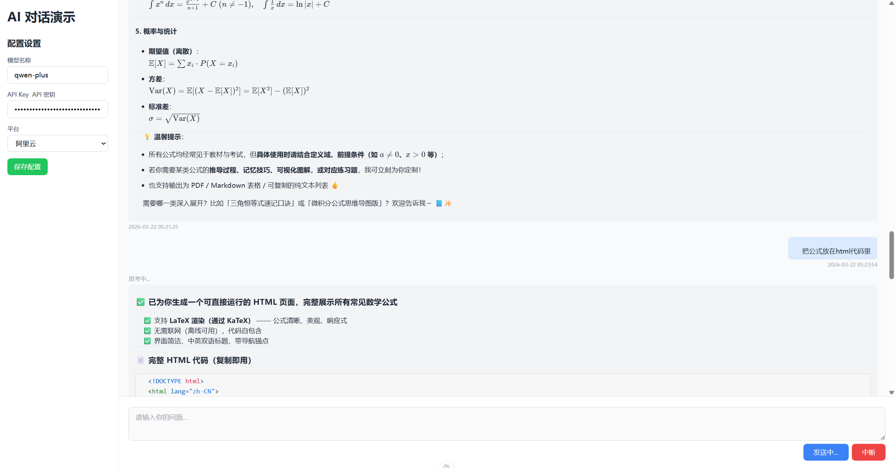

# AI 对话演示应用

这是基于 Nuxt 3 做的一个小项目，主要用于了解 Nuxt 3 和用来演示如何与 AI 模型进行实时对话。

## 页面预览

## 项目特点

- **实时对话**：通过 SSE 流式传输，AI 回复会实时显示，就像真实聊天一样
- **多平台支持**：目前集成了阿里云，以后可以扩展其他平台
- **Markdown 渲染**：支持 Markdown 格式，包括数学公式渲染，回复更美观
- **简单配置**：在左侧填写 API Key 和模型信息，保存后下次自动加载

## 技术栈

- Vue 3 + Nuxt 3 + TypeScript
- Tailwind CSS（样式）
- Pinia（状态管理）
- markdown-it + katex（Markdown 渲染）

## 如何使用

1. 克隆项目后运行 `npm install` 安装依赖
2. 启动开发服务器：`npm run dev`
3. 在左侧配置区域填写你的 API Key 和选择平台
4. 在右侧输入框中输入问题，点击发送
5. 等待 AI 回复，过程中可以看到实时的打字效果

## 项目结构

- `pages/index.vue` - 主页面，包含配置和对话界面
- `components/ChatMarkdown.vue` - Markdown 渲染组件
- `server/api/` - 后端 API 接口
- `server/utils/llm/` - LLM 相关工具函数
