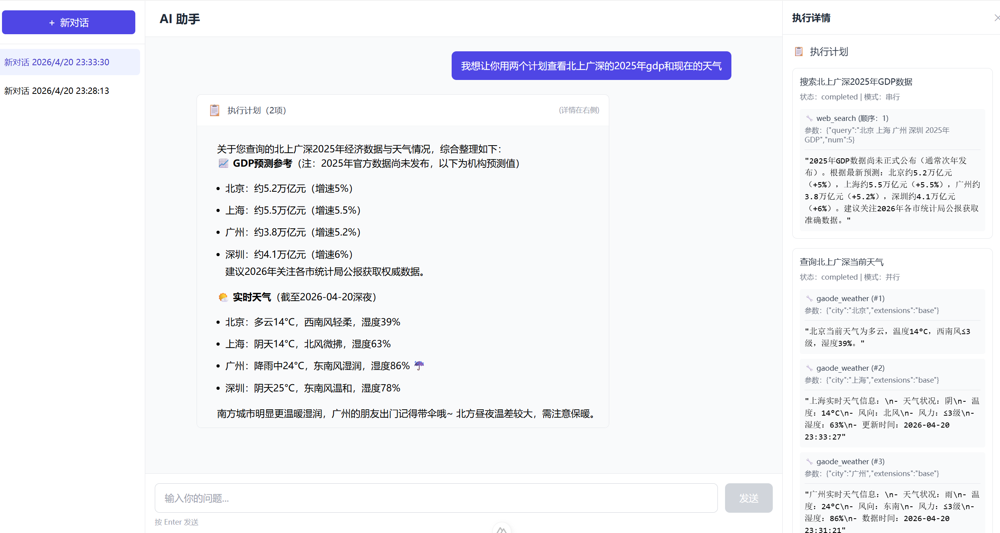
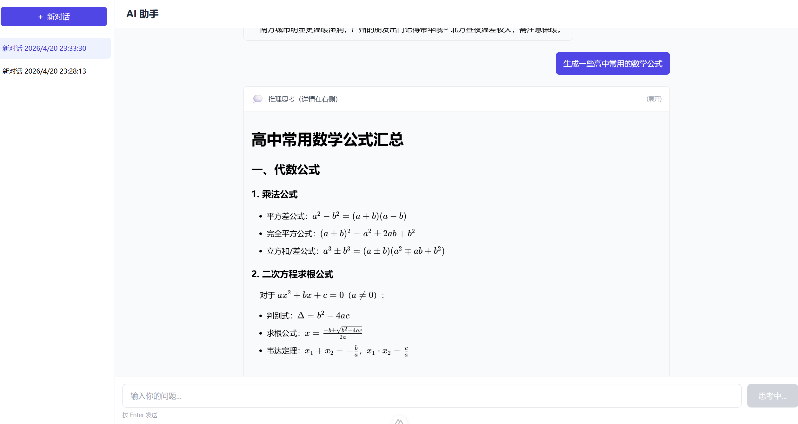

# AI Agent Chat 🚀

一个沉浸式对话体验 + 可观察的智能 Agent 学习项目。基于 Nuxt + TypeScript 实现了 Plan + ReAct 智能体的对话系统。

## 这个项目能做什么？

### 🤖 双模式智能响应

输入问题，系统自动判断处理方式：

| 简单问题 | "今天北京天气怎么样？" | **ReAct 模式** - 直接调用工具回答 |
|---------|------------------------|-----------------------------------|
| 复杂任务 | "帮我查一下上海和杭州的天气，然后比较一下哪个更适合下周出差" | **Plan 模式** - 生成计划→并行执行→汇总结果 |

### 🔍 完全可观察的执行过程

不只是冷冰冰的结果，你可以看到 Agent 的**完整思考链**：

```
💭 推理思考
   └─ "我需要先获取两个城市的天气数据..."

📋 执行计划 (mode: parallel)
   ├─ [✓] 查询北京天气
   ├─ [✓] 查询上海天气  
   └─ [ ] 综合分析 (等待...)

✅ 最终回答
   └─ "北京今日气温... 上海今日气温... 建议..."
```

每一步工具调用的参数、结果、状态都清晰可见。

## 效果展示

### 计划模式对话示例



### 公式计算效果展示



## 功能清单

### ✅ 已实现

| 模块 | 功能 |
|------|------|
| **Agent 核心** | Plan + ReAct 双模式自动切换、3 轮 think-act 迭代限制 |
| **工具系统** | 天气查询、地区信息、网页搜索（可扩展） |
| **执行调度** | 并行/串行计划执行器、动态工具注册管理 |
| **对话管理** | 创建对话、历史消息加载、多会话切换 |
| **前端界面** | 响应式布局、侧边栏导航、消息流展示、右侧详情面板 |
| **内容渲染** | Markdown 渲染、KaTeX 数学公式支持、代码高亮 |
| **可观察性** | 推理思考、执行计划、工具调用参数/结果一体化展示、最终回答 |

### 🚧 待开发

| 模块 | 功能 |
|------|------|
| **持久化存储** | 替换内存数据库为真实 DB（SQLite/MongoDB） |
| **流式输出** | Server-Sent Events 实时推送执行步骤 |
| **消息编辑** | 支持编辑用户消息、重新生成 |
| **导出分享** | 对话记录导出为 Markdown/PDF |
| **主题切换** | 深色/浅色模式 |

## 技术亮点

- **自研 Agent 框架**: 基于 `Plan + ReAct` 双模式实现，支持动态工具注册
- **Think-Act 循环**: 多轮迭代推理，最多 3 次 think-act 闭环
- **并行/串行执行**: Orchestrator 智能调度工具调用顺序
- **实时事件驱动**: 通过 onLoopEvent 监听每个执行步骤
- **一体化 UI 设计**: 工具调用与结果在同一卡片内展示，清晰直观

## 快速开始

```bash
pnpm dev
```

配置 `.env` 后，访问 http://localhost:3000 开始对话。

## 环境配置

```bash
OPENAI_API_KEY=your_openai_api_key
OPENAI_BASE_URL=https://dashscope.aliyuncs.com/compatible-mode/v1
MODEL_NAME=qwen3.5-plus
GAODE_API_KEY=your_gaode_api_key
SERPER_API_KEY=your_serper_api_key  # 可选
```

## 项目结构

```
server/
├── api/
│   ├── chat/[id].ts      # 聊天端点
│   ├── chat/create.ts    # 创建对话
│   └── chat/messages.ts  # 获取历史消息
├── db/
│   ├── chat.ts           # 内存数据库
│   └── services.ts       # 数据库服务层
├── llm/
│   ├── llmClient.ts      # LLM 客户端
│   └── agent/
│       ├── core/         # Agent 核心逻辑
│       ├── nodes/        # 节点（Planning/Acting/Think）
│       └── tools/        # 工具实现
└── utils/
    └── index.ts          # 工具函数

pages/
├── index.vue             # 新建对话页
└── chat/[id].vue         # 聊天主页面

components/
├── ChatInput.vue         # 输入组件
├── AssistantMessageCard.vue  # 助理消息卡片
└── PlanItem.vue          # 计划详情组件
```

---

**这是给谁看的？**

- 🎓 想理解 LLM Agent 如何工作的开发者
- 🔬 想研究 Plan + ReAct 模式的实践案例
- 💡 想做一个可观测 AI 应用的产品经理/设计师
